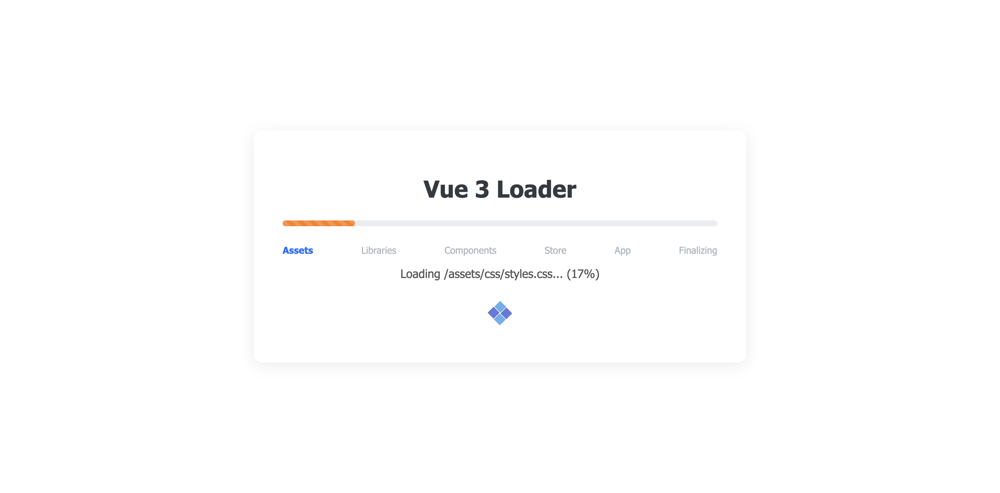

# Vue 3 Loader

> 🌐 Language / Ngôn ngữ: **English** | [Tiếng Việt](README.vi.md)

A Vue 3 demo/starter that runs directly in the browser, using `vue3-sfc-loader` to load Single File Components (SFCs), Pinia for state management, and Vue I18n for dynamic language switching. The project focuses on a staged, progressive loading experience before mounting the main application.



## Key Features

- Runs Vue 3 via CDN, no build step required.
- Dynamically loads `.vue` components using `vue3-sfc-loader`.
- Full-screen loader with an oasis/desert themed UI, progress bar, and step-by-step status updates.
- Sequential loading of assets, libraries, components, stores, and the main app.
- Pinia integration for state management.
- Vue I18n integration with lazy-loaded locale files.
- Supported languages: English, Tiếng Việt, 한국어, 日本語, Deutsch.
- Error handling for failed asset loading, scripts, components, or app initialization.

## Tech Stack

- Vue 3
- Vue 3 SFC Loader
- Vue I18n 11
- Pinia 3
- Vue Demi
- HTML, CSS, and JavaScript modules

## Directory Structure
```text
Vue-3-Loader/
├── index.html
├── assets/
│   ├── css/
│   │   ├── loader.css
│   │   └── styles.css
│   ├── img/
│   │   └── loader.gif
│   └── js/
│       ├── helper.js
│       ├── i18n.js
│       ├── init.js
│       ├── locales/
│       │   ├── de.js
│       │   ├── en.js
│       │   ├── ja.js
│       │   ├── ko.js
│       │   └── vi.js
│       └── stores/
│           └── main.js
├── vue/
│   ├── App.vue
│   ├── Loader.js
│   └── Loader.vue
└── screenshots/
```

## How to Run

This project uses `fetch`, dynamic imports, and absolute paths like `/assets/...`, so it should be served via an HTTP server rather than opening the `index.html` file directly.

Navigate to the project directory:

```bash
cd /workspaces/Vue-3-Loader
```

Run any static server, for example, using Python:

```bash
python3 -m http.server 8000
```

Then open:

```text
http://localhost:8000
```

## Workflow

1. `index.html` loads Vue 3, `vue3-sfc-loader`, Vue I18n, and the initial loader CSS.
2. `assets/js/init.js` creates the configuration for `vue3-sfc-loader`.
3. The app detects the language from `localStorage` or the browser settings.
4. `Loader.vue` is mounted to `#loader`.
5. `Loader.js` executes the loading stages:
   - **assets**: loads `assets/css/styles.css`
   - **libraries**: loads Vue Demi and Pinia
   - **components**: validates `/vue/App.vue`
   - **store**: imports `/assets/js/stores/main.js`
   - **app**: calls `window.initMainApp()`
   - **finalizing**: completes and transitions to the main app
6. `initMainApp()` loads `App.vue`, creates the Vue app, attaches Pinia and i18n, then mounts to `#app`.
7. Upon completion, the loader fades out and `#app` is displayed.

## Main Components

### `vue/Loader.vue`
Defines the full-screen loader UI, including the progress bar, stage list, current status messages, and illustrations.

### `vue/Loader.js`
Contains the sequential loading logic, progress updates, progress bar color shifting per stage, and error handling. It is also responsible for calling `finishLoadApp()` once the app is ready.

### `assets/js/init.js`
Sets up `vue3-sfc-loader`, sharing the module cache for Vue, Vue I18n, and internal i18n modules. This file exposes `window.initMainApp` for the loader to call during the app startup stage.

### `vue/App.vue`
The main application shown after the loader finishes. This component displays the title, description, language switcher, and Pinia store state.

### `assets/js/i18n.js`
Creates the shared i18n instance, lazy-loads locale files based on the selected language, and persists the user's language preference in `localStorage`.

### `assets/js/stores/main.js`
Defines the `main` Pinia store with `message`, `count`, `loadedAt` and actions `increment`, `setLoadedAt`.

## Adding a New Language

1. Create a new locale file in `assets/js/locales`, for example:
   `assets/js/locales/fr.js`

2. Export an object with the same structure as existing locale files:

```js
export default {
  message: {
    title: 'Vue 3 Loader',
    app: {
      subtitle: '...',
      description: '...',
      language: 'Language',
    },
    store: {
      store_state: 'Store State',
      count: 'Count',
      loaded_at: 'Loaded At',
      increment: 'Increment',
      pinia_message: 'Hello from Pinia Store!'
    },
    loader: {
      assets: 'Assets',
      libraries: 'Libraries',
      components: 'Components',
      store: 'Store',
      app: 'App',
      finalizing: 'Finalizing',
      initializing: 'Initializing...',
      loading: 'Loading {item}...',
      starting_app: 'Starting Main App...',
      error_flag: 'Error',
      error_loading: 'Error loading [{stage}]: {message}',
      oasis_route: 'Oasis Route',
      oasis_tagline: 'Across the hot sands, find the oasis',
    },
    errors: {
      failed_to_load: 'Failed to load {item}: {message}',
      network_error: 'Network Error',
      not_found: 'Not Found',
      something_went_wrong: 'Something went wrong',
      init_failed: 'initMainApp reported failure',
      init_undefined: 'initMainApp is not defined',
      unknown_error: 'Unknown error',
      network_error_checking: 'Network error checking {item}: {message}',
      script_execution_failed: 'Script execution failed: {message}',
      failed_to_load_script: 'Failed to load script tag: {item}'
    },
  }
};
```

3. Add the language to `SUPPORTED_LANGUAGES` in `assets/js/i18n.js`:

```js
{ code: 'fr', label: 'Français' }
```

## Customizing the Loader

- The loader UI is located in `vue/Loader.vue`.
- Loader styles are in `assets/css/loader.css`.
- The list of loading stages is in the `stages` computed property in `vue/Loader.js`.
- Progress bar colors are controlled by `progressClass` in `vue/Loader.js` and corresponding CSS classes in `loader.css`.

To add a new stage, add a new object to `stages`:

```js
{
  id: 'custom',
  label: t('message.loader.custom') || 'Custom',
  action: async () => {
    // Logic for loading or checking resources
  }
}
```

Then add the corresponding translation keys to your locale files.

## Development Notes

- Main dependencies are loaded via CDN, so an internet connection is required for the first run.
- Because absolute paths (`/assets/...`, `/vue/...`) are used, run the server from the project root.
- `vue3-sfc-loader` is suitable for demos/prototypes or non-build environments. For large production apps, consider Vite or Vue CLI for bundling, optimized caching, and better dependency management.
- Some delays in the loader are simulated to clearly show each loading stage to the user.

## Screenshots

The `screenshots/` directory contains various loading states and theme examples:

- `screenshots/default-theme-loading-1.png`
- `screenshots/default-theme-loading-2.png`
- `screenshots/default-theme-loaded.png`
- `screenshots/theme-1-loading-1.png`
- `screenshots/theme-11-loading-2.png`

## License

This project is licensed under the [MIT License](./LICENSE).
